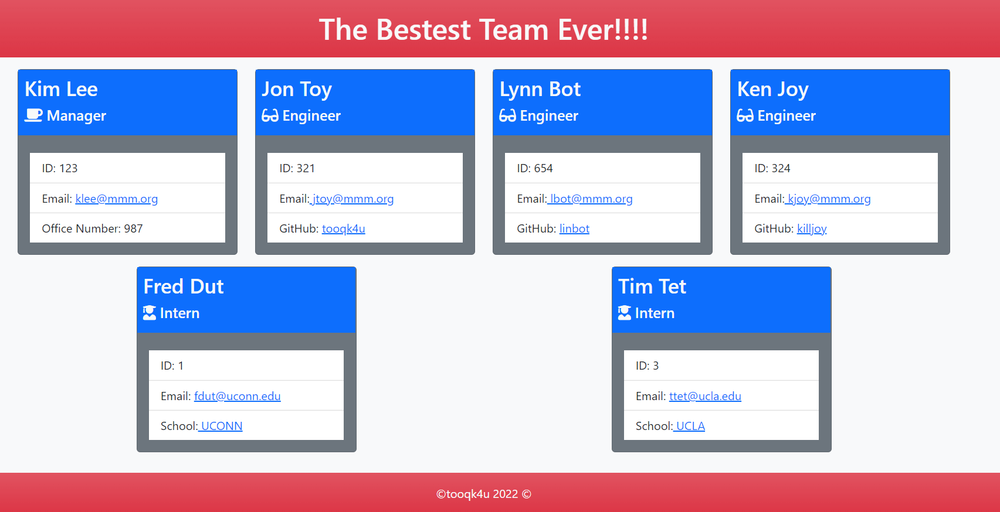

# TEAM PROFILE GENERATOR
  
  

---
## Link
https://github.com/tooqk4u/Team-Profile-Generator

## Description 

  
This project uses node.js and JavaScript in order to utilize the command line to facilitate the generation of Team Profile. This application will prompt the user a series of questions about various employees (Manager, Engineer, Intern). Prompted questions include name, employee ID number, and email. If entering an engineer, a GitHub username prompt is presented,if entering a manage, an office number pormpt is presented, and for intern a School question is asked instead. Multiple entries can be made based on how many employees there are. This application will completely write and style a HTML file to display on the web. At the end of
questionaire a console log will run indicating the profile was generated successfully and which folder to look in to find the finished HTML file.

##### SCREENSHOT EXAMPLE OF GENERATED TEAM PROFILE

---
  
## Table of Contents 

* [Installation](#installation)
* [Usage](#usage)
* [Contributing](#contributing)
* [Tests](#tests)
* [Questions](#questions)
* [Credits](#credits)
* [License](#license)

---
---

## Installation

This is a node application. Node must be installed in order to run this application. See Credits for information on installing node.

This is a terminal prompt application. You must use the terminal to evoke and run this application.

Follow these steps to install this application:

1. Clone the repository to your local machine.
2. In the terminal, navigate to the repository main directory and run npm install to install the required dependencies (see Credits)

You now have everything installed to run this application. See Usage on instruction on how to use this application.

---

## Usage

This is a node application. Node must be installed in order to run this application. See Credits for information on installing node.

This is a terminal prompt application. You must use the terminal to evoke and run this application.

Follow these steps to use this application:

1. In the terminal and repository main directory evoke node index.js
2. You will be met with a prompt to enter information about your team title.
3. Once you finish entering the title information, you will be prompted to enter the employee name, id and email. Then you will be prompted to select the employees role:
- Choose an Engineer to add gitHub link,
- Choose an Intern to add school infomation,
- Chooose a Manager to add office numer,
4. Once you have finished entering all the team employees/interns the select no when asked if you want to add another employee and the console will alert you that the HTML file was generated using the provided information and provides information on which directory to find the html file. 
If there was an error, the console will alert you to it.

See this walk-through video for full usage instructions: https://drive.google.com/file/d/1BK0zxFplFCFsAMtR0ldzekCgKHnRjgKS/view

---
---

## License

Information on the license(s)

https://opensource.org/licenses/MIT

---
---

## Contributing

Guidelines for contributions:

Please fork this directory. Email tooqk4u@protonmail.com if any questions

---
---

## Tests

This application uses jest.js to run the tests suites

There are four test suites:

1. Employee.test
2. Engineer.test
3. Intern.test
4. Manager.test

Each test is designed to ensure that the respective object is created with the appropriate properties and methods returning expected data.

To run the tests, in the terminal envoke npm test. To envoke a specific test suite, envoke npm run test (name) where (name) is the suite (Employee, Engineer, Intern, or Manager).

---
---

## Questions?

Contact me at

Email: [tooqk4u@protonmail.com](mailto:tooqk4u@protonmail.com)

GitHub: [tooqk4u](https://github.com/tooqk4u).

 ---
 ---

## Credits 
 
Shelley Soucie

Andrew Hojnowski TA

Ioannis Sporidis TA

Malcolm Mason TA

Philip Loy Tutor

---
---
---
[Back to Contents](#table-of-contents)
